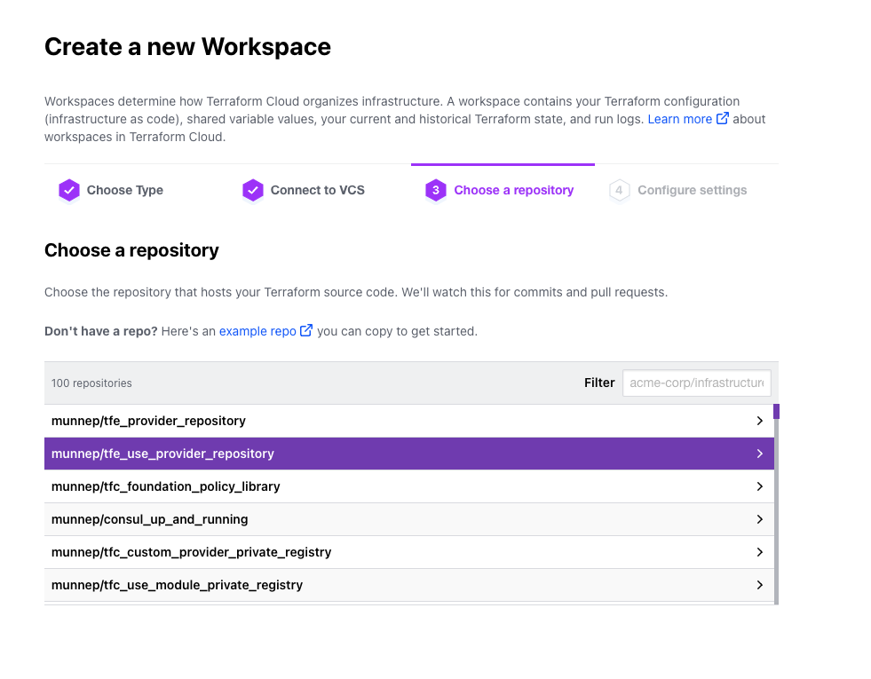

# tfe_use_provider_repository

This repository makes use of a Git Submodule to access commonly used providers. The repository with the providers can be found [here](https://github.com/munnep/tfe_provider_repository). This repository will show the usage of a custom provider on a central repository to be used by Terraform itself. In the provider repository there is a provider called `myprovider` which will be initialized in a run on Terraform Cloud/Terraform Enterprise. 

This provider repository has been added here using the following command

```
git submodule add \
    https://github.com/munnep/tfe_provider_repository.git \
    terraform.d/plugins
```

# Prerequesites

- Have a Terraform Cloud account 
See the following link [Terraform Cloud](https://app.terraform.io/signup/account)

# How to

- Fork the Terraform provider repository to your own environment. Repository can be found [here](https://github.com/munnep/tfe_provider_repository)
- Create a new git repository that you will actually use for the code
- In this new repository add a file called `main.tf` with the following content
```hcl
provider "myprovider" {
}

terraform {
  required_providers {
    myprovider = {
      source = "registry.munnep.com/patrick/myprovider"
      version = "0.1.0"
    }
  }
}
```
- Add your provider repository as a submodule to your new repository
```
git submodule add \
    https://github.com/$ORGANIZATION/$REPOSITORY.git \
    terraform.d/plugins
```	
- Commit all the files and push to your repository
- Login to Terraform Cloud
- Create a new workspace in Terraform cloud
- Select version control workflow  

- Connect it to your VCS repository. If you are using private repository you must use one that has SSH configured in the connection
   
- select the repository you created with the `main.tf` and the submodule  
  
- create the workspace   
  
- On the workspace go to Settings -> Version Control -> Other Settings -> Include submodules on clone -> Update vcs settings
  
- Start a new run  

- If  the plan goes alright without an issue then the initialization of the `myprovider` worked   
   


